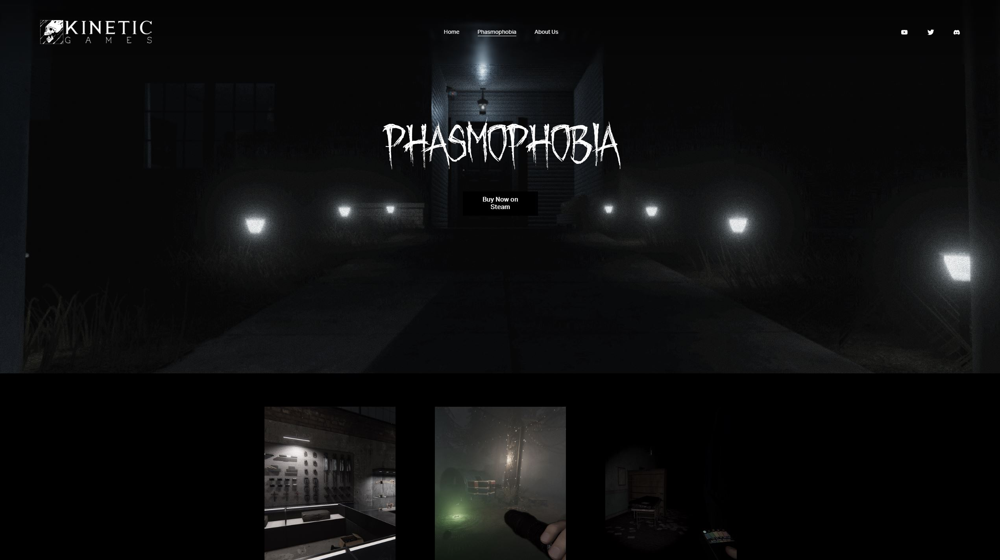
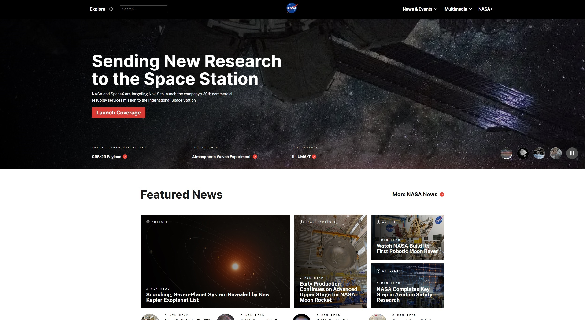
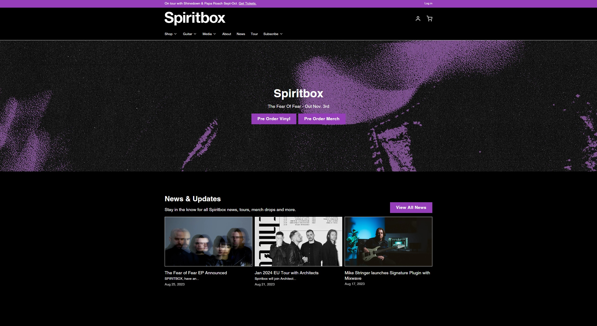

# Phasmeowphobia
A website about the popular ~~ghost~~ cat hunting game

## Inspiration Sites

Official website of the people behind the original game.

I really like that the images have an animated film grain texture overlayed on top:
it makes them feel alive and it reminds me of playing the game (a similar filter is present during gameplay as well).
I am going to steal this concept.

I also like the hero section. Note to self: elaborate on the hero section.

Website of NASA

Website of the band Spiritbox
